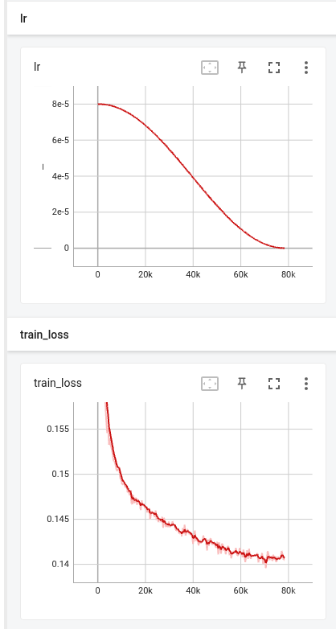

# Denoising Diffusion Probabilistic Model

Original paper: <https://arxiv.org/abs/2006.11239>

## TODO

- [x] Training and generating samples of vanilla DDPM
- [ ] Add dataloader for arbitary image dataset
- [ ] Training on larger size images
- [ ] Trying out Classifier-free guidance

## Training on CIFAR 100 dataset

```
python train.py
```

## Generated samples during training
Each training epoch will render samples twice, each time a set of 64 images are sampled.
```
python render_samples.py
```


## Training log


